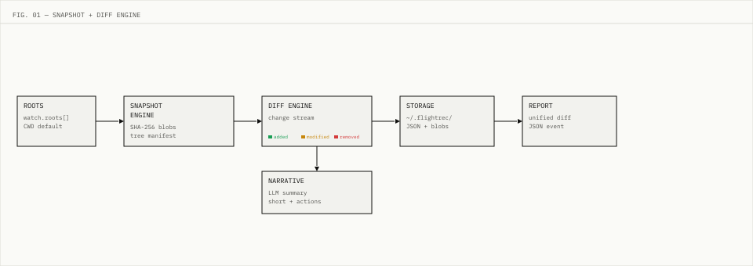

<p align="center">
  <picture>
    <source media="(prefers-color-scheme: dark)" srcset="assets/wordmark-dark.svg">
    
  </picture>
</p>

<p align="center">
  <a href="https://crates.io/crates/flightrec"></a>
  <a href="https://crates.io/crates/flightrec"></a>
  <a href="https://github.com/zakelfassi/flightrec/actions/workflows/ci.yml"></a>
  <a href="https://docs.rs/flightrec"></a>
  <a href="LICENSE"></a>
</p>

<p align="center"><strong>Know what your agent actually did.</strong></p>

> Git-like filesystem observability for AI agents. Snapshots, diffs, and narratives of what actually happened.

<p align="center">
  
  <br>
  <sub>The <a href="assets/demo.tape">VHS tape</a> that generated this GIF is committed to the repository.</sub>
</p>

## Why

AI agents narrate their intent, not their actions. There is a difference. An agent may log "refactoring the auth module" while it deletes a config file, rewrites a test fixture, and leaves a half-edited function in place. The narrative is a summary the agent wrote about itself.

The filesystem does not have this problem. Every create, modify, and delete leaves an objective record. Content-addressed blobs do not lie about what changed, and a unified diff does not editorialize.

flightrec sits outside the agent. It requires no SDK, no tracing call, and no cooperation from the code under observation. It watches directories, snapshots file state, computes diffs, and optionally asks an LLM to narrate what it found — from the filesystem's perspective, not the agent's.

The result is a structured, replayable record of what your agent actually did.

## Quickstart

**Install**

```sh
cargo install flightrec
```

**Initialize**

```sh
$ flightrec init --root ~/my-agent
Config written to ~/.flightrec/config.toml

Next steps:
  flightrec watch --once   # take a snapshot of your watch roots
  flightrec tui            # explore recorded diffs in the TUI
```

**Take a baseline snapshot**

```sh
$ flightrec watch --once
[2026-06-12T19:17:24.413557+00:00] snapshot 20260612T191724-413 — 0 files → ~/.flightrec/snapshots/20260612T191724-413.json
```

**Make a change, capture it**

```sh
$ echo 'Planning to refactor auth module' > ~/my-agent/notes.md

$ flightrec watch --once
[2026-06-12T19:17:24.425324+00:00] snapshot 20260612T191724-425 — 1 files → ~/.flightrec/snapshots/20260612T191724-425.json
  1 changes:
    + ~/my-agent/notes.md
```

**Replay what happened**

```sh
$ flightrec replay
[2026-06-12T19:17:24.425554+00:00] diff-20260612T191724-425 — 1 changes
  [Added] ~/my-agent/notes.md
```

For an interactive view of the full timeline: `flightrec tui`

## Features

| Capability | Status |
|---|---|
| Content-addressable snapshots | ✅ |
| Structured diffs (JSON) | ✅ |
| Unified line diffs | ✅ |
| Timeline replay | ✅ |
| Markdown and JSON reports | ✅ |
| LLM narratives (Anthropic, OpenAI, Ollama) | ✅ |
| Interactive TUI | ✅ |
| `flightrec init` | ✅ |
| Event-driven watch (inotify / FSEvents) | [🚧][roadmap] |
| Webhooks | [🚧][roadmap] |
| Web timeline UI | [🚧][roadmap] |
| Blob GC | [🚧][roadmap] |

[roadmap]: ROADMAP.md

## How it works

<p align="center">
  
</p>

The watch loop takes a snapshot of each configured root, computes a diff against the previous snapshot, persists both to `$FLIGHTREC_HOME`, and optionally calls an LLM provider to summarize the changes. Storage is content-addressable: blobs are written once and deduplicated by SHA-256 hash, git-style.

Full pipeline, storage layout, and data schemas: [docs/architecture.md](docs/architecture.md)

## Configuration

`flightrec init` writes a starter `config.toml` in `$FLIGHTREC_HOME` (default `~/.flightrec`).

```toml
[watch]
roots = ["~/my-agent"]

[filter]
include = ["**/*.md", "**/*.rs", "**/*.toml", "**/*.json"]
exclude = ["**/.git/**", "**/target/**", "**/node_modules/**"]

[daemon]
interval_seconds = 60

[llm]
enabled = false
provider = "anthropic"
model = "claude-haiku-4-5"
```

Full reference: [docs/config-reference.md](docs/config-reference.md) — runnable examples: [examples/](examples/)

## Positioning

| Tool | What it records | Requires agent changes |
|---|---|---|
| git | Committed work only | No |
| Agent tracing / OTel | The agent's own self-report | Yes — SDK instrumentation in agent code |
| fswatch / watchman | File-change events; no snapshots, diffs, or narratives | No |
| **flightrec** | Ground-truth filesystem state: snapshots, diffs, narratives | No |

flightrec records ground truth without touching the agent.

## Examples

| Example | What it covers |
|---|---|
| [watch-a-repo](examples/watch-a-repo/) | Single root, 30-second interval — the 90-second hello world |
| [multi-root](examples/multi-root/) | Multiple roots for fleet and ops audit scenarios |
| [llm-narratives](examples/llm-narratives/) | LLM enabled with Anthropic claude-haiku |
| [ollama-local](examples/ollama-local/) | Local Ollama provider for private workloads |
| [agent-session-audit](examples/agent-session-audit/) | Tight include filters, 10-second interval — catch mid-session changes |

## Development

```sh
cargo fmt --all --check && cargo clippy --all-targets -- -D warnings && cargo test --all-targets
```

Development workflows are defined as executable skills in `skills/` ([Skills-Driven Development](https://agentskills.io)).

---

[ROADMAP.md](ROADMAP.md) · [CONTRIBUTING.md](CONTRIBUTING.md) · [SECURITY.md](SECURITY.md) · [LICENSE](LICENSE)
